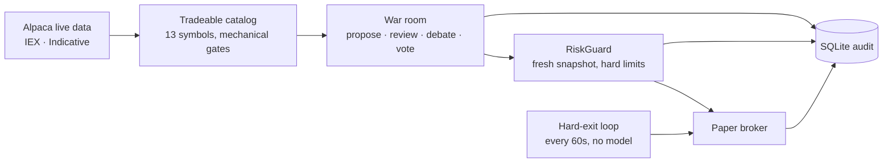

<h1 align="center">NøIdea</h1>

<p align="center">
  <em>An autonomous options trader for an Alpaca paper account.</em><br>
  <strong>Agents decide what they want to do. C# decides what they are permitted to do.</strong>
</p>

<p align="center">
  
  
  
  
  
</p>

---

One .NET 10 console host reads an Alpaca paper account, builds a tradeable option catalog from
current market data, runs a four-model war room over it, applies deterministic risk rules, and
submits paper orders. Every sitting, tool call, review pass, vote, decision, and order lands in
SQLite before any money moves.

<p align="center">
  
</p>

<p align="center">
  <sub>One sitting end to end, dry run, 2026-09-03. The proposer searches for 4:58 across 20 tool
  calls and proposes an NVDA 222.50 call. Four reviewers analyse in parallel and each one's
  reasoning is on the record: the skeptic tries to falsify three load-bearing claims and finds no
  contradiction, the quant abstains, and <code>exposure</code> rejects because the trade would take
  the last position slot. After one discussion round and a rebuttal the room votes 2–1–1, net 0.09,
  and sizes it at 9%. Being a dry run, the order it would have sent is printed and nothing reaches
  the broker. 11 model calls, 1,176,049 tokens, 1.5160 USD.</sub>
</p>

## The premise

I don't know how to trade options. So I gave the judgement to frontier models and kept the
permission to spend money in ordinary, testable C#.

A model can propose anything it likes. `RiskGuard` decides what reaches the broker, it runs on an
account snapshot read after the debate ends, and no vote can outrank it. The models hold read-only
research tools and no broker tool at all. The typed `Alpaca.Markets` SDK is the only write path in
the process.

## How it works



Two independent timers run during regular US market hours:

| Loop | Interval | What it does |
|---|---|---|
| Cycle | 30 min | Build the catalog, review open positions, run new-trade sittings |
| Hard exit | 1 min | Stop-loss, take-profit, and the forced flatten. No model in the path. |

The exit loop is separate because Alpaca offers no stop order type and no bracket order class for
options. At the cycle cadence a stop-loss would be sampled once every ~40 minutes, which does not
save a one-to-three-day option.

## AI logic: the war room

Every model in the system sits here. A sitting produces one typed proposal and four private
votes. It cannot produce an order.

One sitting runs propose → pre-validate → independent analysis → discussion → rebuttal →
private vote.

| Seat | Provider | Role |
|---|---|---|
| `proposer` | Grok 4.6 | Searches the allowed universe. Full research toolset. May answer `NO_TRADE`. |
| `skeptic` | Anthropic | Tries to falsify the strongest claim, and approves it when it survives. |
| `quant` | OpenAI | Judges the contract: strike, expiration, spread, liquidity, maximum loss. |
| `market` | OpenAI | Judges price action, market context, news, scheduled events. |
| `exposure` | **none** | Portfolio arithmetic in plain C#. Costs nothing and cannot hallucinate. |

Types and tests enforce three properties that prompt wording alone would not hold:

- **Independence.** Analyses form in parallel; no reviewer sees another's before writing its own.
  A room that agrees because the first speaker anchored it is pure cost.
- **Privacy.** `RoomContext` has no votes field, so no future edit can leak one seat's vote into
  another seat's prompt. A test asserts the property does not exist.
- **Arithmetic.** Stated numbers are checked, not trusted. The proposer copies the bid, ask,
  underlying price, delta and IV it reasoned from into typed fields. `ProposalPreValidator` compares
  each against the catalog and returns `REJECT_FABRICATED_QUOTE` beyond 1% drift, before any
  reviewer is paid.

A new trade needs the vote net above threshold and at least one seat that actually voted Approve.
An earlier build let a room of unanimous abstentions clear a negative threshold and open a position
no seat backed; dilution is not consent. A close needs only the threshold, because a position must
stay easy to leave.

## Risk gates: what reaches the broker

Four gates stand between a vote and an order. All four are plain C# and no vote can overrule
them.

1. **The catalog gate.** A contract enters the room only if it already passes the mechanical
   checks: two-sided quote, quote age, spread ÷ ask, DTE, per-trade premium, and the slot and
   daily-open counts. A typical cycle drops ~6,700 of ~7,300 contracts before a model is paid.
2. **The pre-validation gate.** Numbers the proposer states are compared with the catalog and
   rejected beyond 1% drift, before any reviewer is paid.
3. **The vote gate.** Quorum, threshold, and one seat that voted Approve. A faulted seat counts
   as a rejection.
4. **`RiskGuard`, last and closest to the money.** It re-reads the current quote for the selected
   contract and takes a fresh account snapshot *after* the debate ends, so it judges the trade the
   broker would get rather than the one the room discussed. On 2026-09-02 that re-read turned a
   debated ask of 15.42 into a fill at 13.92.

A missing prior-close equity, an unknown pending-buy risk, a missing quote, or a failed audit
write all stop new risk rather than guess. Every value below is a compile-time default in
`RiskOptions`. There is no config file and no environment binding for them.

| Limit | Value |
|---|---:|
| Risk per trade | 2% of equity |
| Total premium exposure | 10% of equity |
| Daily loss halt | 5% from prior-close equity |
| Concurrent open + pending positions | 4 |
| Filled opens per market day | 4 |
| Days to expiration | 1–21 |
| Contracts per trade | 5 |
| Spread ÷ ask | 15% |
| Maximum quote age | 10 min |

Long calls and long puts only. Premium paid is the whole maximum loss. Open decisions and order
reservations commit in one SQLite transaction, and a failed audit write stops the live session.

## Alpaca implementation

**Two paths to Alpaca, split by caller.** Models get research; only C# gets the broker.

| Path | Used by | Carries |
|---|---|---|
| Alpaca MCP server (read-only) | the four model seats | quotes, bars, snapshots, chains, news, calendar, movers |
| Typed `Alpaca.Markets` SDK | deterministic C# only | account, positions, clock, market data, order submit and cancel |

- **The MCP server is pinned and allowlisted.** `external/alpaca-mcp-server` is a submodule fixed
  at one commit, started with the read-only toolsets `assets,stock-data,options-data,news,
  corporate-actions`. Of the 34 tools it exposes, the host hands the seats an explicit 23. A
  forbidden tool name (order, position change, exercise, shell, file, secret) stops startup rather
  than being filtered at call time. There is no trading MCP connection to misconfigure.
- **Data feeds are named in every request**, so no call can silently escalate to a paid feed:
  `MarketDataFeed.Iex` for stocks, `OptionsFeed.Indicative` for option chains. Chains are read
  1,000 rows per page and every page token is followed; a partial chain excludes that underlying
  for the cycle.
- **Every SDK client is fixed to `Environments.Paper`.** The gateways (`IMarketDataGateway`,
  `ITradingGateway`) return project-owned records, never SDK types, and the market-data gateway
  has no order method.
- **Alpaca accepts fewer order shapes for options than for equities.** Market or limit, day only,
  no bracket and no OCO class. **An option order cannot carry a stop-loss**, which is why the
  60-second exit loop exists.
- **Orders are idempotent and reconciled.** Each submission carries a client order ID that is
  reserved in SQLite inside the same transaction as its decision. At startup the host looks up
  unsettled orders by that ID: an uncertain buy is quarantined and never replayed, while an
  uncertain risk-reducing sell can be retried with the same ID. Alpaca stays the source of truth
  for positions and orders; SQLite stores evidence, not broker state.

## Quick start

**Prerequisites:** .NET 10 SDK, Docker Desktop, an Alpaca *development* paper account.

```bash
git submodule update --init --recursive     # external/alpaca-mcp-server
cp .env.example .env                        # add Alpaca + model keys
docker compose -f compose.dev.yaml up -d --build
docker compose -f compose.dev.yaml ps       # must report (healthy)
```

The read-only MCP server binds to `127.0.0.1:8100` and has no authentication. Never publish it.

```bash
# Decide everything, send nothing. Safe out of hours.
dotnet run --project src/Xakpc.Alpaca.NøIdea -- --live --dry-run --once --allow-stale-quotes

# Trade the paper account.
dotnet run --project src/Xakpc.Alpaca.NøIdea -- --live

# Read the evidence back.
dotnet run --project src/Xakpc.Alpaca.NøIdea -- --audit --last 20
```

`.env` needs the Alpaca paper keys and three model keys: `ANTHROPIC_API_KEY`, `OPENAI_API_KEY`,
`XAI_API_KEY`. The seats sit on three providers on purpose, because a room of one model arguing
with itself shares that model's blind spots. Startup fails and names any missing key, because a
seat without a key is a dead seat and that failure belongs before the open, not at 09:31.
`--agent stub` needs none of them. `KEENABLE_API_KEY` adds web research and is optional.

`--cheap` swaps in Claude Haiku 4.5 and GPT-5.4-nano; the standard profile is Claude Sonnet 5 and
GPT-5.6-terra. Both keep Grok 4.6 on the proposer.

### Commands

| Command | Effect |
|---|---|
| `--live` | Run the market-clock loop and permit paper orders. |
| `--live --dry-run` | Live reads and full audit; broker writes are intercepted. |
| `--audit [--last N]` | Open SQLite read-only, print evidence, exit nonzero on an integrity fault. |
| `--recover-sittings` | Mark sittings a stopped process left open as `abandoned`. |
| `--check-mcp` | Connect, list, and validate the read-only MCP toolset. |
| `--smoke` | **Mutates the paper account:** buys an option, then cancels or closes it. |

A normal live process stops when the Alpaca clock reports the market closed, so an unattended host
cannot spend model tokens tomorrow. Start a new process for the next session.

## The audit trail

`data/trader.db` holds the evidence for every run. Six audit tables (`war_room_sittings`,
`proposal_review_passes`, `agent_tool_calls`, `decision_events`, `orders`, `equity_snapshots`),
plus `strategy_state` and `position_review_state` for restart. `--audit` opens the database
read-only and exits nonzero on an incomplete sitting, a missing tool result, a missing decision
link, or an unlinked order.

A refusal is stored with its reasons: the option symbol, the forecast probability, and a
kebab-case rejection code, so it can be scored later against what the contract actually did.

## What the live sessions showed

Four live days, 100,000.00 → 101,274.64, about 41 USD of real model spend. Four days of paper
trading is not a track record. The audit trail does show which part of the system produced the
result, and where it failed:

- **The deterministic exits produced every dollar.** NVDA was bought at 4.59 and the 60-second
  loop sold it at +54%. META was carried overnight and sold at +114% at the next open. No model
  was in either path, and no war-room open has yet produced a profit on its own.
- **The fresh quote at the gate saved 150 USD.** The room debated META at an ask of 15.42. The gate
  re-read the quote and the fill was 13.92. The stale number never authorised money.
- **A delayed close costs money.** A GOOGL close was proposed at a bid of 4.90 and rejected on a net
  of exactly 0.00. The same close was approved two hours later and filled near 4.43.
- **A half-dead room cannot trade, and it does not notice.** On the last day two of four seats
  failed on every call from the first cycle. A faulted seat is an outright rejection, so seven
  complete sittings, each with a real proposal and an approving skeptic, were rejected on quorum.
  The run spent 10 USD proving it. Four earlier cycles were lost silently, because a failed
  proposer call is recorded as a legitimate `NO_TRADE`.

Per-session numbers, per-seat costs, and sitting durations are in
[`.lode/operations/session-results.md`](.lode/operations/session-results.md). Every measured
session ran from the debug profile: one discussion round, a −0.15 threshold, and a 20-minute
cycle.

## Known limits

Kept here on purpose rather than in an issue tracker nobody opens:

- **A failed model call can look like a decision.** A proposer transport fault or timeout is
  recorded as `NO_TRADE` with no retry, so the audit cannot tell a refusal from a broken call.
- **A repeated provider fault has no breaker.** The same quota error came back 42 times in four
  hours and the loop kept calling.
- **A room that cannot reach quorum still sits.** Nothing checks that the seats which must vote
  can answer before the proposer is paid, and a quorum failure is stored as a room vote.
- **A cost line reports zero for a seat that failed.** Token counts come from a response and a
  failed call has none, so a broken seat and a free seat look the same.
- Nothing refuses an open near the forced flatten, so a position opened a minute before it is legal
  and is sold 60 seconds later at the full spread.
- The exit loop lives inside the process. No process is no stop-loss, and Alpaca offers no
  broker-side substitute for options.
- The daily opening limit is first-come. Nothing compares the fourth trade of the morning against a
  better one in the afternoon.
- Live startup verifies the schema but does not run the integrity audit.
- Counterfactual scoring of stored rejections is designed and not yet built.
- The forced flatten instant and the accepted expiration window are hardcoded dates that have now
  passed. A new live run needs a new horizon first.

## Layout

```text
src/Xakpc.Alpaca.NøIdea/     Agents · Alpaca · Research · Storage · Trading · Observability
tests/                       195 xUnit tests
external/alpaca-mcp-server/  Pinned upstream MCP server (submodule)
docker/, compose.dev.yaml    Read-only MCP server for local development
.lode/                       Project memory: architecture, decisions, contracts, session results
DEVELOPMENT.md               Full workstation setup and troubleshooting
```

The operator view is read-only Spectre.Console. Each run line carries an event id from
`Observability/RunEvents.cs`, and every process also writes the complete log to a timestamped
plain file under `data/logs/`. A console fault cannot stop trading or the audit write.

```bash
dotnet test Xakpc.Alpaca.NøIdea.slnx --nologo
```

Built for the [Alpaca AI Trading Agents hackathon](https://lablab.ai/ai-hackathons/alpaca-ai-trading-agents-hackathon).
Alpaca Basic market data: IEX for stocks, the free Indicative feed for option chains. All SDK
clients are fixed to `Environments.Paper`.

It trades a paper account, and the numbers above are four days of paper results. This is not
financial advice. Point it at real money at your own risk.

Licensed under the [MIT License](LICENSE) · Pavel Osadchuk · [github.com/xakpc](https://github.com/xakpc)
