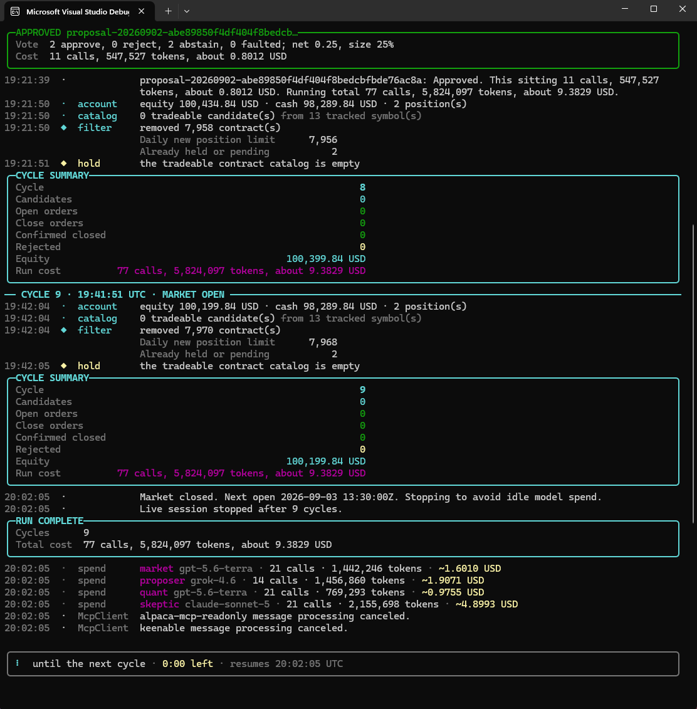
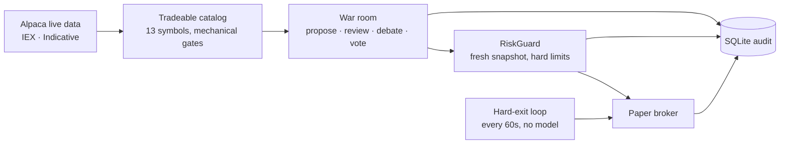

<h1 align="center">NøIdea</h1>

<p align="center">
  <em>An autonomous options trader for an Alpaca paper account.</em><br>
  <strong>Agents decide what they want to do. C# decides what they are permitted to do.</strong>
</p>

<p align="center">
  
  
  
  
  
</p>

---

One .NET 10 console host reads an Alpaca paper account, builds a tradeable option catalog from
current market data, runs a four-model war room over it, applies deterministic risk rules, and
submits paper orders. Every sitting, tool call, review pass, vote, decision, and order lands in
SQLite before any money moves.

<p align="center">
  
</p>

<p align="center">
  <sub>The last two cycles of 2026-09-02 and the run summary. The catalog is empty because the
  day's fourth open had already filled, so <code>daily-new-position-limit</code> refuses all 7,968
  contracts and the room can only review what is already open. Per-seat spend is printed at the
  end of every run.</sub>
</p>

## The premise

I don't know how to trade options. So the judgement is delegated to frontier models, and the
permission to spend money stays in ordinary, testable C#.

A model can propose anything it likes. `RiskGuard` decides what reaches the broker, it runs on an
account snapshot read *after* the debate ends, and no vote can outrank it. The models hold
read-only research tools and no broker tool at all — the typed `Alpaca.Markets` SDK is the only
write path in the process.

## How it works



Two timers run during regular US market hours, and they are deliberately independent:

| Loop | Interval | What it does |
|---|---|---|
| Cycle | 30 min | Build the catalog, review open positions, run new-trade sittings |
| Hard exit | 1 min | Stop-loss, take-profit, and the forced flatten — **consults no model** |

The exit loop is separate because Alpaca offers no stop order type and no bracket order class for
options. At the cycle cadence a stop-loss would be sampled once every ~40 minutes, which does not
save a one-to-three-day option.

## The war room

One sitting is five phases: **propose → pre-validate → independent analysis → discussion →
rebuttal → private vote.**

| Seat | Provider | Role |
|---|---|---|
| `proposer` | Grok 4.6 | Searches the allowed universe. Full research toolset. May answer `NO_TRADE`. |
| `skeptic` | Anthropic | Tries to falsify the strongest claim, and approves it when it survives. |
| `quant` | OpenAI | Judges the contract: strike, expiration, spread, liquidity, maximum loss. |
| `market` | OpenAI | Judges price action, market context, news, scheduled events. |
| `exposure` | **none** | Portfolio arithmetic in plain C#. Costs nothing and cannot hallucinate. |

Three properties are enforced by types and tests, not by prompt wording:

- **Independence.** Analyses form in parallel; no reviewer sees another's before writing its own.
  A room that agrees because the first speaker anchored it is pure cost.
- **Privacy.** `RoomContext` *has no votes field*, so no future edit can leak one seat's vote into
  another seat's prompt. A test asserts the property does not exist.
- **Stated numbers are checked, not trusted.** The proposer copies the bid, ask, underlying price,
  delta and IV it reasoned from into typed fields. `ProposalPreValidator` compares each against the
  catalog and returns `REJECT_FABRICATED_QUOTE` beyond 1% drift — before any reviewer is paid.

A new trade needs the vote net above threshold **and** at least one seat that actually voted
Approve. An earlier build let a room of unanimous abstentions clear a negative threshold and open a
position no seat backed; dilution is not consent. A close needs only the threshold, because a
position must stay easy to leave.

## Guardrails

Every value below is a compile-time default in `RiskOptions`. There is no config file and no
environment binding for them.

| Limit | Value |
|---|---:|
| Risk per trade | 2% of equity |
| Total premium exposure | 10% of equity |
| Daily loss halt | 5% from prior-close equity |
| Concurrent open + pending positions | 4 |
| Filled opens per market day | 4 |
| Days to expiration | 1–21 |
| Contracts per trade | 5 |
| Spread ÷ ask | 15% |
| Maximum quote age | 10 min |

Long calls and long puts only. Premium paid is the whole maximum loss. Open decisions and order
reservations commit in one SQLite transaction, and a failed audit write stops the live session.

## Quick start

**Prerequisites:** .NET 10 SDK, Docker Desktop, an Alpaca *development* paper account.

```bash
git submodule update --init --recursive     # external/alpaca-mcp-server
cp .env.example .env                        # add Alpaca + model keys
docker compose -f compose.dev.yaml up -d --build
docker compose -f compose.dev.yaml ps       # must report (healthy)
```

The read-only MCP server binds to `127.0.0.1:8100` and has no authentication. Never publish it.

```bash
# Decide everything, send nothing. Safe out of hours.
dotnet run --project src/Xakpc.Alpaca.NøIdea -- --live --dry-run --once --allow-stale-quotes

# Trade the paper account.
dotnet run --project src/Xakpc.Alpaca.NøIdea -- --live

# Read the evidence back.
dotnet run --project src/Xakpc.Alpaca.NøIdea -- --audit --last 20
```

`.env` needs the Alpaca paper keys and **three** model keys — `ANTHROPIC_API_KEY`,
`OPENAI_API_KEY`, `XAI_API_KEY`. The seats sit on three providers on purpose: a room of one model
arguing with itself shares that model's blind spots. Startup fails and names any missing key,
because a seat without a key is a dead seat and that failure belongs before the open, not at 09:31.
`--agent stub` needs none of them. `KEENABLE_API_KEY` adds web research and is optional.

`--cheap` swaps in Claude Haiku 4.5 and GPT-5.4-nano; the standard profile is Claude Sonnet 5 and
GPT-5.6-terra. Both keep Grok 4.6 on the proposer.

### Commands

| Command | Effect |
|---|---|
| `--live` | Run the market-clock loop and permit paper orders. |
| `--live --dry-run` | Live reads and full audit; broker writes are intercepted. |
| `--audit [--last N]` | Open SQLite read-only, print evidence, exit nonzero on an integrity fault. |
| `--recover-sittings` | Mark sittings a stopped process left open as `abandoned`. |
| `--check-mcp` | Connect, list, and validate the read-only MCP toolset. |
| `--smoke` | **Mutates the paper account:** buys an option, then cancels or closes it. |

A normal live process stops when the Alpaca clock reports the market closed, so an unattended host
cannot spend model tokens tomorrow. Start a new process for the next session.

## The audit trail

`data/trader.db` is evidence, not a log. Six audit tables — `war_room_sittings`,
`proposal_review_passes`, `agent_tool_calls`, `decision_events`, `orders`, `equity_snapshots` —
plus `strategy_state` and `position_review_state` for restart. `--audit` returns failure on an
incomplete sitting, a missing tool result, a missing decision link, or an unlinked order, so "the
run went fine" is a checkable claim rather than a recollection.

A refusal that carries its reasons is a decision, not a fault: rejections are stored with the
option symbol, the forecast probability, and a kebab-case rejection code, so a refusal can be
scored later against what the contract actually did.

## What the first trading day showed

2026-09-02, the first day the room traded: 13 sittings, 4 opens, 2 closes, equity 100,000.00 →
**100,199.84**, for about **17 USD** of real model spend. A sitting costs 0.80–2.09 USD and 11
model calls. Two days of paper trading is not a track record. What the audit trail does support is
*which part of the system* produced the result:

- **The deterministic exit produced the day.** NVDA was bought at 4.59 and the 60-second exit loop
  sold it at +54%, with no model in the path. That single exit is larger than the day's net.
- **The fresh quote at the gate saved 150 USD.** The room debated META at an ask of 15.42. The gate
  re-read the quote and the fill was 13.92. The stale number never authorised money.
- **A delayed close costs money.** A GOOGL close was proposed at a bid of 4.90 and rejected on a net
  of exactly 0.00. The same close was approved two hours later and filled near 4.43.

## Known limits

Kept here on purpose rather than in an issue tracker nobody opens:

- Nothing refuses an open near the forced flatten, so a position opened a minute before it is legal
  and is sold 60 seconds later at the full spread.
- The scan window asks for up to 21 DTE while the flatten permits four, so thousands of contracts
  are read each cycle that no gate can admit.
- The daily opening limit is first-come. Nothing compares the fourth trade of the morning against a
  better one in the afternoon.
- Live startup verifies the schema but does not run the integrity audit.
- Counterfactual scoring of stored rejections is designed and not yet built.

## Layout

```text
src/Xakpc.Alpaca.NøIdea/     Agents · Alpaca · Research · Storage · Trading · Observability
tests/                       195 xUnit tests
external/alpaca-mcp-server/  Pinned upstream MCP server (submodule)
docker/, compose.dev.yaml    Read-only MCP server for local development
.lode/                       Project memory: architecture, decisions, contracts, baselines
DEVELOPMENT.md               Full workstation setup and troubleshooting
```

The operator view is read-only Spectre.Console. Every line that tells the story of a run carries
an event id from `Observability/RunEvents.cs`, and each process also writes the complete log to a
timestamped plain file under `data/logs/`. A console fault cannot stop trading or the audit write.

```bash
dotnet test Xakpc.Alpaca.NøIdea.slnx --nologo
```

Built for the [Alpaca AI Trading Agents hackathon](https://lablab.ai/ai-hackathons/alpaca-ai-trading-agents-hackathon).
Alpaca Basic market data: IEX for stocks, the free Indicative feed for option chains. All SDK
clients are fixed to `Environments.Paper`.

**This is not financial advice and not a product.** It trades a paper account, and the numbers
above are two days of paper results, not a track record. Point it at real money at your own risk.

Licensed under the [MIT License](LICENSE) · Pavel Osadchuk · [github.com/xakpc](https://github.com/xakpc)
