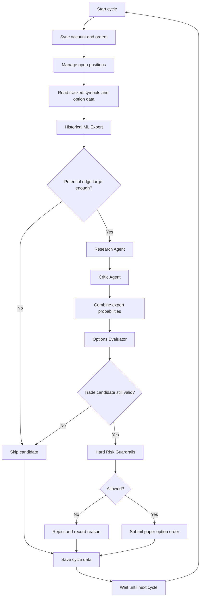
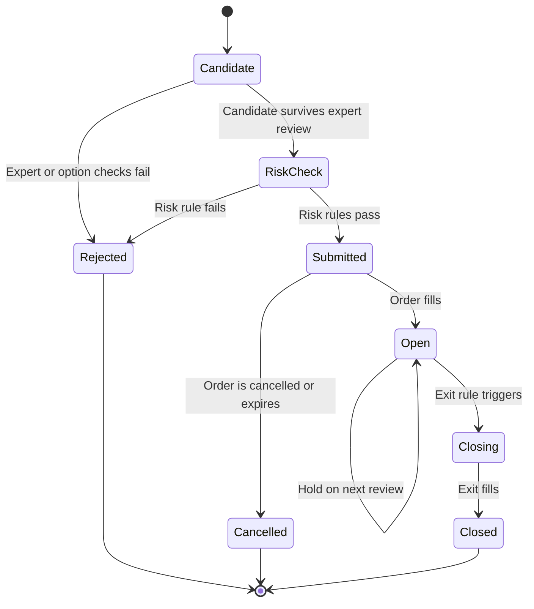
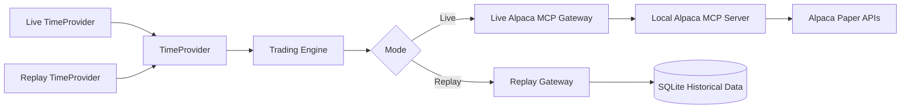
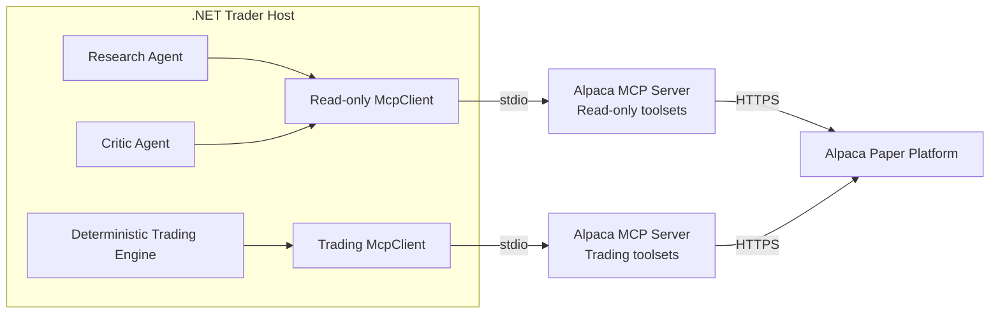
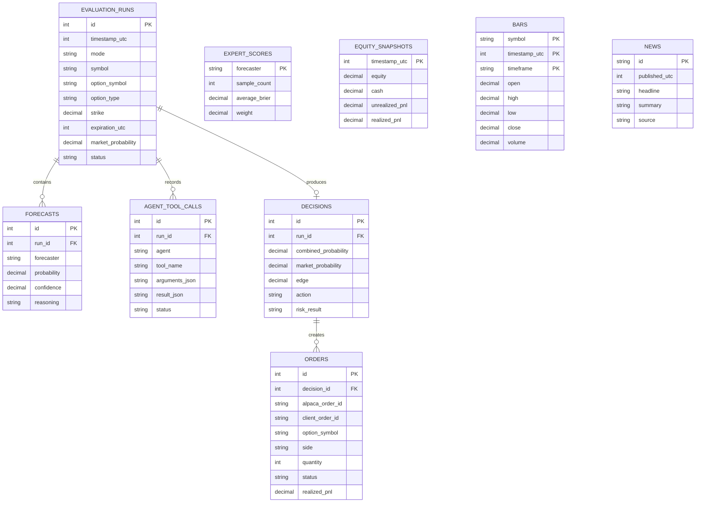
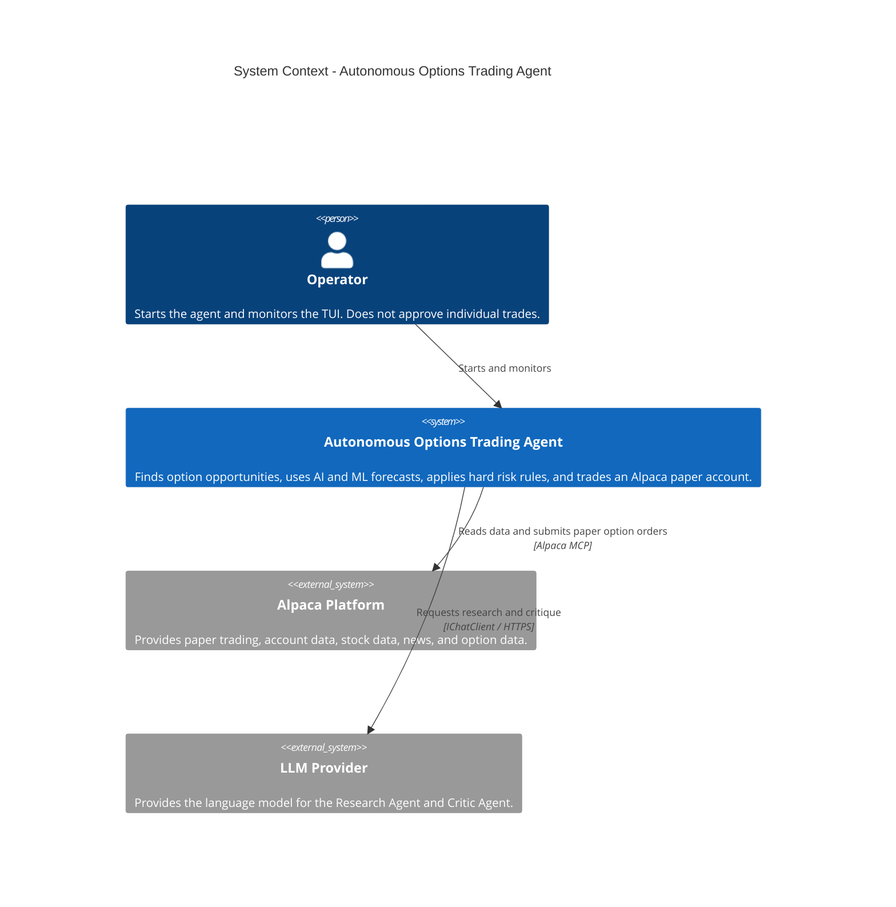
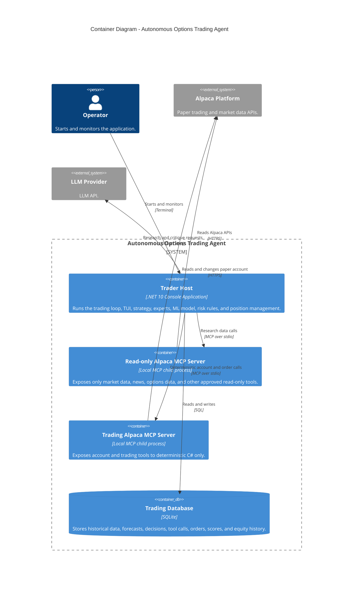
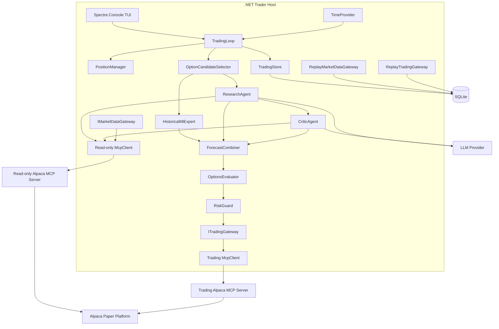

# Architecture Vision Document
## Autonomous Options Trading Agent for the Alpaca AI Trading Agents Hackathon

**Status:** Archived historical input. Do not implement from this file.
**Date:** 2026-08-29  
**Language:** ASD-STE100-style Simplified Technical English  
**Primary implementation language:** C# / .NET  
**Trading environment:** Alpaca paper trading only
**Architecture revision:** 4 -- The war room replaces the weighted four-expert combiner

---

## Revision History

| Revision | Date | Change |
|---|---|---|
| 1 | 2026-08-29 | Initial architecture used Alpaca CLI. |
| 2 | 2026-08-29 | Replaced Alpaca CLI with two Alpaca MCP connections: read-only research and deterministic trading. |
| 3 | 2026-08-29 | Updated scoring semantics, Basic option-data timing, MCP option capabilities, option order types, and deployment rules from the latest FAQ. |
| 4 | 2026-08-30 | **Replaced the four-expert weighted combiner with the war room.** The Historical ML Expert is excluded (ADR-013). Decisions now come from a proposer plus independent reviewers on three model providers, a debate, a rebuttal, and a private confidence-weighted vote that sets position size. See ADR-019 to ADR-022. |

---

> ## Revision 4 note: read the lode first
>
> This document seeded the project and is **history, not a source of truth**. Where it and
> `.lode/` disagree, the lode wins; where the lode and the code disagree, the code wins.
>
> Three parts of this document have been retired by measurement and by design:
>
> **The Historical ML Expert is not a forecaster (ADR-013).** It was trained, measured against
> the option price on 149,838 questions, and lost in every period including the one it was
> fitted on. An equal blend with the market was worse than the market alone. It carries no
> weight and gates nothing. What survives is the ladder-slope market probability, which scores
> Brier 0.13787 with monotonic calibration.
>
> **The weighted combiner is replaced by the war room (ADR-019).** There is no longer a set of
> experts emitting probabilities that a reliability-weighted average merges. Instead: a
> proposer searches and proposes, reviewers analyse **independently** so nobody anchors the
> room, the room debates, the proposer defends or modifies or withdraws, and everyone votes
> **privately**. Confidence-weighted votes set the position size rather than producing a
> combined probability.
>
> **The historical market simulation and data-import design is removed.** The current host
> reads Alpaca market data only. SQLite stores durable live and dry-run audit evidence only.
> The retained raw files are outside the runtime path.
>
> Unchanged, and still the spine of the design: **agents decide what they want to do;
> deterministic C# decides what they are permitted to do.**
>
> See `.lode/summary.md` and `.lode/war-room/summary.md`.

# 1. Purpose


This document defines the architecture vision for an autonomous AI options trading agent.

The system is for the Alpaca AI Trading Agents Hackathon.

The system must:

- Trade without manual approval after the operator starts it.
- Use the Alpaca Trading API through the Alpaca MCP.
- Trade options.
- Generate measurable profit and loss (P&L).
- Keep a full record of each forecast, decision, order, and result.
- Use AI only where AI gives useful value.
- Keep trade execution and risk limits in deterministic C# code.

The system is a hackathon system. It is not a production trading product. It must use paper trading only.

---

# 2. Competition Constraints

The following items come from the latest official LabLab / Alpaca FAQ supplied for this project.

- The official paper account starts with **$100,000**.
- The official P&L window starts on **Monday, 2026-08-31 at 09:30 ET**.
- The measurement window formally ends on **Friday, 2026-09-04 at 09:30 ET**.
- The FAQ also states that Alpaca will evaluate the portfolio's **total equity as of end of day Thursday, 2026-09-03**.
- Exercises and assignments for options that expire on Thursday, 2026-09-03 are reflected in that Thursday end-of-day value.
- The architecture therefore treats **Thursday end of day as the effective final portfolio state**.
- The system must not depend on new Friday option-market activity to improve the competition result.
- Alpaca measures performance by **total account equity**, not only by cash balance.
- Risk-adjusted metrics such as Sharpe ratio, Sortino ratio, and maximum drawdown are not part of the official P&L score.
- P&L is important, but P&L is not the only judging criterion.
- The judges also evaluate creativity, autonomy, and robustness.
- There is no live competition scoreboard.
- Final performance comes from the dedicated live paper account. Historical replay and simulated shocks are supporting evidence only.
- A graphical user interface is not required.
- A hosted application is not required when the agent runs autonomously and only places orders. A GitHub repository is sufficient.
- The repository can remain private during the hackathon.
- Pre-event infrastructure, boilerplate, and the owner's existing libraries can be reused.
- Pre-event work that is used in the submission must be disclosed.
- The free Alpaca market data tier is permitted.
- The free tier uses the Alpaca **Indicative options feed**.
- The latest option quotes and chains from the API are real-time on the Basic plan.
- The 15-minute restriction on Basic applies to historical option bars and trades, not to the latest option quote.
- Dashboard charts can lag. The agent must use API / MCP data for decisions.
- The paid OPRA feed is permitted, but it is not required.
- This project will use the free feed only.
- The project must use either Alpaca MCP or Alpaca CLI.
- This project will use **Alpaca MCP**.
- Alpaca MCP supports option contracts, option chains, quotes, Greeks, single-leg option orders, and multi-leg option orders.
- Supported MCP option order types are market, limit, stop, and stop-limit.
- Trailing-stop orders are for stocks, not options.
- There are no hackathon restrictions on option strategy type.
- There are no restrictions on model provider or hosting infrastructure.

The project can use a separate paper account for development and testing before the official P&L window. The official $100,000 account must not be used as the development account.

---

# 3. Architecture Goals

## 3.1 Primary goals

The architecture must support these goals:

1. The system runs without per-trade human approval.
2. The system can find, evaluate, open, monitor, and close option positions.
3. The system can use numerical models and LLM agents in one decision.
4. Each expert must produce a testable result.
5. The system must record which experts are accurate.
6. The system must give more influence to experts that have better measured performance.
7. The system must compare its forecast with current option market information.
8. The system must apply hard risk limits before it sends an order.
9. The system must recover safely after a process restart.
10. The system must support historical replay before the live competition window.

## 3.2 Secondary goals

The architecture should also:

- Be small enough to implement in a few days.
- Use one .NET application host.
- Use SQLite as the only database.
- Use a terminal user interface (TUI).
- Keep external dependencies to a minimum.
- Keep all important trading logic in C#.
- Use the official C# MCP SDK for Alpaca access.
- Keep LLM-visible Alpaca tools read-only.
- Make the full decision path easy to show in a demo.

---

# 4. Non-Goals

The following items are not goals for this version:

- A web user interface.
- React.
- A mobile application.
- Microservices.
- Kubernetes.
- A message broker.
- Semantic Kernel.
- Alpaca CLI.
- A custom Claude Agent SDK process.
- A Python service.
- A Node.js service.
- High-frequency trading.
- Sub-second market reaction.
- Scanning all US stocks.
- Production use with real money.
- A complete options pricing engine.
- A complete quantitative trading platform.
- A general-purpose AI agent framework.

---

# 5. Key Terms

This section defines finance terms in simple language.

## 5.1 Stock

A stock is a share in a company.

Examples:

- AAPL
- MSFT
- NVDA

SPY and QQQ are exchange-traded funds (ETFs), but the system can treat them as tracked market symbols.

## 5.2 Option

An option is a contract that is linked to the future price of a stock or ETF.

A **call** usually gains value when the stock price goes up.

A **put** usually gains value when the stock price goes down.

## 5.3 Strike

The strike is the price in the option contract.

Example:

- NVDA price now: $180
- Call strike: $190

The call is linked to the $190 strike.

## 5.4 Expiration

Expiration is the date when the option contract ends.

## 5.5 Premium

The premium is the price of the option.

US equity options normally represent 100 shares. An option price of $3.00 therefore normally means a contract cost of about $300.

## 5.6 Equity

Account equity is the current total value of the account.

It includes:

- Cash.
- The current value of open positions.
- Unrealized profit and loss.

The hackathon uses total equity for the official P&L result.

## 5.7 Edge

In this project, **edge** means the difference between:

- The probability that our system estimates.
- A probability reference that comes from current option market data.

Example:

- Our estimate: 60%.
- Market reference: 42%.
- Edge: +18 percentage points.

A large difference can be a trade candidate.

This does not prove that the trade will make money.

## 5.8 Alpha

Alpha means a useful advantage that can produce better returns than a simple market approach.

For this project, the possible alpha is:

> The combined system can estimate a short-term price outcome better than the current option pricing can.

This is a hypothesis. The project must test it.

## 5.9 Greek

An option Greek is a number that describes how an option price reacts to a change.

The main Greeks are:

- Delta: sensitivity to stock price movement.
- Gamma: sensitivity of delta.
- Theta: sensitivity to time decay.
- Vega: sensitivity to expected volatility.

The first version does not need to use all Greeks.

The first version can use delta as one input for an approximate market probability reference. This is only a proxy. Delta is not an exact real-world probability.

---

# 6. Core Trading Hypothesis

The system tests this hypothesis:

> A numerical model and LLM-based research can find short-term cases where the probability of a stock price outcome is different from the probability reference in current option pricing.

The system does not ask one LLM to select a trade from nothing.

The system uses independent sources of information.

The system then checks if these sources agree enough to justify an option trade.

---

# 7. The War Room

> Revision 4 replaced the four-expert model with a war room. See ADR-019 to ADR-022 and
> `.lode/war-room/summary.md`.

Decisions come from several agents that argue and then vote. One class, `WarRoomSession`,
serves both new trades and reviews of open positions: they differ only in the request.

## 7.1 The five phases

```text
1. PROPOSE            one proposer searches and puts one operation forward, or says NO_TRADE
2. PRE-VALIDATE       C# checks the proposal can legally exist, before tokens are spent
3. ANALYSE            reviewers form a first opinion in parallel, seeing nobody else's
4. DEBATE             every analysis is shared; reviewers challenge each other
5. REBUT + VOTE       the proposer defends, modifies or withdraws; then everyone votes privately
```

**Independence is the point of phase 3.** Sharing opinions first lets the earliest speaker
anchor the room, and a room that agrees because it was anchored is pure cost.

**Privacy is the point of phase 5.** `RoomContext` carries no votes field at all, so one
persona's vote cannot reach another's prompt.

## 7.2 The seats

A persona is a class, not a configuration row. Every model-backed seat gets the **same**
read-only tools and differs by **model**, because a room of one model arguing with itself
shares that model's blind spots.

| Seat | Provider | Role |
|---|---|---|
| Proposer | Claude Opus 5 | Searches the universe. Carries the full read-only Alpaca toolset. |
| Skeptic | Claude Sonnet 5 | Assumes the proposal is wrong. |
| Quant | GPT-5 | Judges the contract: strike, expiration, spread, liquidity, maximum loss. |
| Market | Grok 4 | Price action, market context, news and scheduled events. |
| Exposure | **none** | Portfolio arithmetic in plain C#. No tokens, no hallucination. |

The exposure seat proves the persona interface is not an LLM interface. It does not replace
`RiskGuard`, which enforces the hard limits and cannot be outvoted.

## 7.3 What a persona can never do

A persona analyses, discusses and votes. It cannot submit, cancel or close an order, and it
holds no tool that could. A seat that fails is recorded as a fault, counted as an abstention,
and **never as an approval**.

# 8. Votes to Verdict and Size

Deterministic C# in `VoteTally`. No model touches it, because it decides how much money is at
risk.

```text
net = Σ(+confidence approve, −confidence reject, 0 abstain) ÷ every voter

net ≤ ApproveThreshold  → rejected
net >  ApproveThreshold → approved, contracts = max(1, round(desired × net))
```

Confidence-weighted rather than a head count: a persona that is barely persuaded should not
cancel one that is certain. Abstentions dilute conviction without opposing. A faulted voter
divides into the total rather than vanishing, so a half-broken room cannot look unanimous.

`ApproveThreshold` starts at **0**. Raising it makes the room stricter.

> This is the single number most likely to decide whether the system ever trades. A room that
> rejects everything produces a four-day run holding cash, which is a loss and not safety.

An approved proposal always trades at least one contract: rounding a positive conviction down
to zero would turn an approval into a rejection wearing the same name.

**The vote is not permission to trade.** It only lets the proposal reach `RiskGuard`, which
validates again immediately before submission.

# 9. Tracked Symbols

The first version uses a fixed list of liquid symbols.

Initial list:

```text
SPY
QQQ
AAPL
MSFT
NVDA
AMZN
META
GOOGL
TSLA
AMD
```

The fixed list has these benefits:

- The implementation is small.
- The options markets are active.
- The symbols have frequent news.
- The system does not need a market-wide stock scanner.
- The system can focus on the quality of the decision process.

The list is configuration data.

The architecture does not require these exact symbols.

The system does not ask an LLM to discover which companies exist.

---

# 10. Live Trading Cycle

The target cycle time is approximately 30 minutes during regular US market hours.

The exact interval is a configuration value.

The system uses the Alpaca market clock. It must not use a hard-coded assumption that every weekday is a trading day.

The live loop is:

1. Sync the account.
2. Manage existing positions.
3. Read option data for tracked symbols.
4. Run the cheap numerical filter.
5. Call the LLM agents only for good candidates.
6. Combine the expert forecasts.
7. Evaluate the option.
8. Apply hard risk limits.
9. Submit an option order if all checks pass.
10. Save all data.
11. Wait until the next cycle.



---

# 11. Detailed Live Flow

## 11.1 Step 1: Sync account

This step is deterministic.

The system reads:

- Current account equity.
- Cash.
- Open positions.
- Open orders.
- Alpaca market clock.

Alpaca is the source of truth for current positions and current orders.

The LLM does not take part in this step.

## 11.2 Step 2: Manage existing positions

This step is primarily deterministic.

The position policy can check:

- Profit target.
- Loss limit.
- Time to expiration.
- Quote validity.
- Strategy invalidation.
- Competition close rules.

The exact values are strategy parameters.

They are **TBD** until replay tests are complete.

An LLM re-check can run only when the system has a reason to do it.

Possible triggers:

- Important new news.
- Large price change.
- Large change in the numerical forecast.
- A scheduled long-interval review.

The system must not call the LLM for every position on every 30-minute cycle without a reason.

## 11.3 Step 3: Read candidate option contracts

The system gets the current option chain for each tracked symbol.

The first version must limit the number of contracts that it evaluates.

The exact contract-selection rule is **TBD**.

The rule must include:

- Valid bid and ask.
- Acceptable quote age.
- A supported expiration.
- A supported call or put type.
- No obvious bad or missing data.

## 11.4 Step 4: Cheap filter

The filter decides what is **worth an agent call**. Whether a trade could legally exist is a
different question, answered by `ProposalPreValidator` inside the room.

For each tracked symbol: read the spot price, require fresh news when the policy asks for it,
pull the call and put chains inside the policy expiration window and a strike band around
spot, compute the ladder market probability, drop anything already held, and keep the cheapest
candidates that fall inside the tradeable probability band.

The filter **cannot** key on a model-versus-market gap. That gap was measured and tracks the
model's own error, so filtering on it would select the candidates the model understands least
(ADR-013).

## 11.5 Step 5: The war room

The proposer receives the filtered candidates, the portfolio, the remaining capacity and the
allowed actions. It puts one operation forward or answers `NO_TRADE`.

If it proposes something, C# pre-validates the structure, then the reviewers analyse
independently, debate, hear the proposer's rebuttal, and vote privately. A modified proposal
re-enters pre-validation.

See section 7.

## 11.6 Step 6: Hard risk guardrails

Hard risk guardrails are C# rules.

The LLM cannot change them.

Examples:

- Maximum risk per trade.
- Maximum number of open positions.
- Maximum new positions per day.
- Maximum total account risk.
- Maximum daily account loss.
- No duplicate order.
- No duplicate exposure that violates a configured rule.
- No trade with missing or stale data.
- No unsupported option expiration.
- No order if SQLite cannot record the decision.
- No order if the system cannot confirm paper mode.

The exact financial values are **TBD**.

The architecture supports the following development defaults, but these are not final strategy values:

```text
Maximum concurrent positions: 4
Maximum new positions per day: 4
Cycle interval: 30 minutes
```

Risk per trade, take-profit level, stop level, minimum edge, and expiration rules require replay tests before the official run.

## 11.7 Step 7: Submit order

Only deterministic C# code can submit an order.

The order goes through the typed Alpaca MCP adapter.

For options, Alpaca MCP supports:

- Market orders.
- Limit orders.
- Stop orders.
- Stop-limit orders.

The strategy must not depend on trailing-stop option orders because Alpaca supports trailing stops for stocks, not options.

For position exits, the Position Manager can monitor the option and submit a market or limit order to close it.

The system must create a unique `client_order_id`.

The system must save this ID before or with the order attempt.

This protects the system from duplicate orders after an uncertain retry.

## 11.8 Step 8: Persist result

The system records:

- Input data.
- Expert outputs.
- Tool calls.
- Market probability reference.
- Combined probability.
- Final decision.
- Risk decision.
- Order ID.
- Position result.
- Equity snapshot.

---

# 12. Position Lifecycle



The system does not close a position only because time passed.

The exit policy must match the strategy.

The system must prevent accidental option expiration if expiration handling is not part of the strategy.

---

# 13. Historical Replay Mode

Historical replay is required before the official run.

Replay has these goals:

- Train the ML.NET model.
- Test the trading decision logic.
- Test the expert prompts.
- Measure expert forecast quality.
- Initialize expert reliability weights.
- Test risk limits.
- Find obvious strategy errors.
- Test the full system without a live order.

## 13.1 Replay architecture

The live and replay modes must use the same strategy code.

Only the data source and clock change.

The live path uses Alpaca MCP.

The replay path uses SQLite data and does not start a live Alpaca MCP connection.



---

## 13.2 Replay data

Historical data can include:

- Stock bars.
- ETF bars.
- Option bars when available.
- News.
- Stored option snapshots when available.

The system must cache historical data in SQLite.

The replay process must not call Alpaca for the same historical data on each run.

## 13.3 No future-data leak

At replay time `T`, every expert must see only data that was available at or before `T`.

This rule is mandatory.

The Research Agent tools in replay mode must read from the replay data source.

They must not call the live Alpaca MCP.

## 13.4 Train and test split

The ML dataset must use a time-based split.

Example:

```text
Older period -> Training
Later period -> Validation
Newest period -> Test
```

The system must not use a random train/test split for time-series market data.

## 13.5 Replay limitations

Historical replay will not always reproduce the exact live options market.

The free data source can have limits.

Historical option-chain snapshots can differ from live option-chain data.

Therefore:

- Replay is valid for model and agent calibration.
- Replay can test strategy logic.
- Replay can test many order and risk rules.
- Replay P&L is only as accurate as the stored historical option data.

The project must state these limits in the submission.

---

# 14. LLM Architecture

## 14.1 Decision

The project does not use Semantic Kernel.

The project does not use the Claude Agent SDK.

The project uses:

- `Microsoft.Extensions.AI`
- `IChatClient`
- `FunctionInvokingChatClient`
- The official Anthropic C# SDK
- The official C# MCP SDK (`ModelContextProtocol`)
- Alpaca MCP Server

The exact Claude model is configuration.

The architecture does not depend on one model name.

## 14.2 Why `Microsoft.Extensions.AI`

The required agent behavior is small:

1. Give the model a forecast question.
2. Give the model a limited set of read-only Alpaca MCP tools.
3. Let the model choose which tools to call.
4. Execute those tool calls through the C# MCP client.
5. Return tool results to the model.
6. Continue until the model returns a final structured forecast.

`IChatClient` and function invocation support this flow.

A larger agent framework does not add enough value for this project.

## 14.3 MCP tool policy

> **Superseded by ADR-001.** There is **one** MCP connection and it is read-only.
> Deterministic C# reaches Alpaca through the typed `Alpaca.Markets` SDK instead, so the
> trading connection was deleted and has no consumer. The isolation is therefore stronger
> than described below: no MCP server this host runs holds an order tool at all, so there
> is no toolset split to misconfigure. The read-only half of this section still applies.

The system originally used two separate Alpaca MCP connections.

### Read-only research MCP connection

This connection is visible to the Research Agent and Critic Agent.

It exposes only read-only tool groups that are required for research.

Typical capabilities:

```text
Stock bars and quotes
News
Option chains and option snapshots
Greeks when available
Reference-symbol market data
Asset and contract metadata
```

It must not expose tools that can change the paper account.

The .NET host can apply both controls:

1. Start the Alpaca MCP server with read-only toolsets only.
2. Filter the discovered MCP tools before it adds them to `ChatOptions.Tools`.

This is defense in depth.

### Trading MCP connection

This connection is used only by deterministic C# code.

It can expose:

```text
Account state
Orders
Positions
Option order submission
Order cancellation
Position close
```

The trading MCP tools are never added to an LLM tool list.

## 14.4 LLM write isolation

The LLM must not get an MCP tool that can:

```text
Submit order
Replace order
Cancel order
Close position
Exercise option
```

The LLM must also not get:

```text
Arbitrary shell execution
Arbitrary file access
Environment secret access
```

The LLM can research and forecast.

Deterministic C# owns all account-changing actions.

---

# 15. Alpaca MCP Integration

## 15.1 Decision

The system uses Alpaca MCP instead of Alpaca CLI.

The latest hackathon FAQ explicitly confirms that the official Alpaca MCP server can:

- Fetch option contracts.
- Fetch option chains.
- Retrieve option quotes.
- Retrieve option Greeks.
- Place single-leg option orders.
- Place multi-leg option orders.

Supported option order types through MCP are:

- Market.
- Limit.
- Stop.
- Stop-limit.

Trailing-stop orders are not supported for options.

Reasons:

- The Anthropic C# SDK and `Microsoft.Extensions.AI` can use MCP tools directly.
- The official C# MCP SDK manages MCP client connections.
- The Alpaca MCP server already exposes market data, news, options, account, and trading tools.
- The Research Agent and Critic Agent can choose read-only Alpaca tools without custom C# wrappers for each data operation.
- Deterministic C# can call trading tools directly through a separate MCP client.
- The system does not need to start one CLI process for each Alpaca operation.
- The architecture can use server-side toolset restrictions to prevent LLM trading access.

The Alpaca MCP server is a local dependency of the .NET application.

The application must pin the Alpaca MCP server version for the competition.

## 15.2 Connection model

The .NET application creates two MCP clients.



The two connections should use separate local Alpaca MCP server instances.

The read-only instance must not receive a trading toolset.

The trading instance can receive the toolsets required for deterministic account operations.

## 15.3 Research tool integration

At startup:

1. Start the read-only Alpaca MCP server.
2. Connect with `McpClient`.
3. Call `ListToolsAsync()`.
4. Filter the returned tools to the approved allowlist.
5. Add the approved tools to the `IChatClient` options for the Research Agent and Critic Agent.

Conceptual example:

```csharp
var readOnlyMcp = await McpClient.CreateAsync(readOnlyTransport);

var approvedTools = (await readOnlyMcp.ListToolsAsync())
    .Where(IsApprovedResearchTool)
    .ToArray();

var chatOptions = new ChatOptions
{
    Tools = [experts/research-agent.md approvedTools]
};
```

The exact API syntax can change with package versions.

The architecture requirement is the important part:

> The LLM receives only approved read-only Alpaca MCP tools.

## 15.4 Trading integration

Strategy code must not depend on MCP tool names or raw MCP result objects.

Use a small typed facade.

Example:

```csharp
public interface ITradingGateway
{
    Task<AccountSnapshot> GetAccountAsync(CancellationToken ct);
    Task<MarketClock> GetClockAsync(CancellationToken ct);
    Task<IReadOnlyList<Position>> GetPositionsAsync(CancellationToken ct);
    Task<IReadOnlyList<Order>> GetOpenOrdersAsync(CancellationToken ct);

    Task<OrderResult> SubmitOptionOrderAsync(
        OptionOrderRequest request,
        CancellationToken ct);

    Task<OrderResult> CancelOrderAsync(
        string orderId,
        CancellationToken ct);

    Task<OrderResult> ClosePositionAsync(
        string optionSymbol,
        CancellationToken ct);
}
```

Live implementation:

`AlpacaMcpTradingGateway`

Replay implementation:

`ReplayTradingGateway`

The live implementation maps typed C# requests to specific Alpaca MCP tool calls.

The Research Agent does not use this interface.

## 15.5 Read data for deterministic code

The deterministic parts of the application also need market data.

Use a small read facade where typed C# code requires stable data structures.

Example:

```csharp
public interface IMarketDataGateway
{
    Task<IReadOnlyList<Bar>> GetBarsAsync(experts/historical-ml-expert.md.);
    Task<IReadOnlyList<NewsItem>> GetNewsAsync(experts/critic-agent.md.);
    Task<OptionChain> GetOptionChainAsync(experts/options-evaluator.md.);
}
```

Live implementation:

`AlpacaMcpMarketDataGateway`

Replay implementation:

`ReplayMarketDataGateway`

The LLM can use the discovered MCP tools directly.

The deterministic ML and option-evaluation code uses the typed gateway.

## 15.6 MCP safety

The application must:

- Use paper trading credentials only.
- Reject startup if paper mode cannot be confirmed.
- Pin the Alpaca MCP server version.
- Start the research MCP server with read-only toolsets.
- Never add trading MCP tools to an LLM tool list.
- Keep a second MCP connection for deterministic trading actions.
- Use a unique `client_order_id` for each new order when the Alpaca tool supports it.
- Record MCP tool names and arguments for audit.
- Apply timeouts to MCP calls.
- Stop new trading if the MCP server is unavailable.
- Treat an incompatible MCP tool schema as an integration failure.

---

# 16. Free Market Data Policy

The project will not purchase Algo Trader Plus or OPRA.

The project will use the free Alpaca **Indicative options feed**.

The latest official hackathon FAQ confirms:

- Latest option quotes are real-time on the Basic plan.
- Latest option chains are real-time on the Basic plan.
- The 15-minute Basic-plan restriction applies to historical option bars and trades.
- The 15-minute restriction does not apply to the latest option quote.
- Dashboard charts can lag.
- The agent must use API / MCP data rather than dashboard charts for decisions.
- Full OPRA data requires Algo Trader Plus and is not provided automatically.

The Indicative feed is not the full OPRA feed.

Therefore:

- The system can use current Basic-plan option quotes for live decisions.
- The system must not assume that the Indicative feed is identical to consolidated OPRA.
- The strategy should require a meaningful pricing difference and should not depend on a very small quote difference.
- The Options Evaluator must reject stale, missing, one-sided, or otherwise unusable quotes.
- Historical replay must account for the delay and availability limits of historical option bars and trades.

The project must state the use of the free Indicative feed in the final submission.

---

# 17. SQLite Data Design

## 17.1 Database role

SQLite stores:

- Historical market data.
- Historical news.
- Expert forecasts.
- LLM tool calls.
- Decisions.
- Orders submitted by this application.
- Expert reliability.
- Equity snapshots.

SQLite is not the source of truth for current broker positions.

Alpaca is the source of truth for current positions and orders.

Simple rule:

> Alpaca stores what the account owns. SQLite stores what the agent thought and did.

## 17.2 Database technology

Use:

- SQLite.
- `Microsoft.Data.Sqlite`.
- Direct SQL.

Do not add an ORM unless direct SQL becomes a real problem.

## 17.3 Tables

### `bars`

```sql
CREATE TABLE bars (
    symbol          TEXT NOT NULL,
    timestamp_utc   INTEGER NOT NULL,
    timeframe       TEXT NOT NULL,
    open            REAL NOT NULL,
    high            REAL NOT NULL,
    low             REAL NOT NULL,
    close           REAL NOT NULL,
    volume          REAL NOT NULL,
    PRIMARY KEY (symbol, timeframe, timestamp_utc)
);
```

### `news`

```sql
CREATE TABLE news (
    id              TEXT PRIMARY KEY,
    published_utc   INTEGER NOT NULL,
    headline        TEXT NOT NULL,
    summary         TEXT,
    source          TEXT,
    symbols_json    TEXT NOT NULL
);
```

### `evaluation_runs`

One row represents one evaluated option event.

```sql
CREATE TABLE evaluation_runs (
    id                      INTEGER PRIMARY KEY AUTOINCREMENT,
    timestamp_utc           INTEGER NOT NULL,
    mode                    TEXT NOT NULL,
    symbol                  TEXT NOT NULL,
    current_price           REAL NOT NULL,
    option_symbol           TEXT NOT NULL,
    option_type             TEXT NOT NULL,
    strike                  REAL NOT NULL,
    expiration_utc          INTEGER NOT NULL,
    market_probability      REAL,
    status                  TEXT NOT NULL,
    market_snapshot_json    TEXT
);
```

### `forecasts`

```sql
CREATE TABLE forecasts (
    id                  INTEGER PRIMARY KEY AUTOINCREMENT,
    run_id              INTEGER NOT NULL,
    forecaster          TEXT NOT NULL,
    probability         REAL NOT NULL,
    confidence          REAL,
    reasoning           TEXT,
    evidence_json       TEXT,
    created_utc         INTEGER NOT NULL,
    FOREIGN KEY (run_id) REFERENCES evaluation_runs(id)
);
```

### `agent_tool_calls`

```sql
CREATE TABLE agent_tool_calls (
    id                  INTEGER PRIMARY KEY AUTOINCREMENT,
    run_id              INTEGER NOT NULL,
    agent               TEXT NOT NULL,
    tool_name           TEXT NOT NULL,
    arguments_json      TEXT NOT NULL,
    result_json         TEXT,
    started_utc         INTEGER NOT NULL,
    duration_ms         INTEGER,
    status              TEXT NOT NULL,
    FOREIGN KEY (run_id) REFERENCES evaluation_runs(id)
);
```

### `decisions`

```sql
CREATE TABLE decisions (
    id                      INTEGER PRIMARY KEY AUTOINCREMENT,
    run_id                  INTEGER NOT NULL,
    combined_probability    REAL NOT NULL,
    market_probability      REAL,
    edge                    REAL,
    action                  TEXT NOT NULL,
    reason                  TEXT,
    risk_result             TEXT,
    created_utc             INTEGER NOT NULL,
    FOREIGN KEY (run_id) REFERENCES evaluation_runs(id)
);
```

### `orders`

```sql
CREATE TABLE orders (
    id                  INTEGER PRIMARY KEY AUTOINCREMENT,
    decision_id         INTEGER NOT NULL,
    alpaca_order_id     TEXT,
    client_order_id     TEXT NOT NULL UNIQUE,
    option_symbol       TEXT NOT NULL,
    side                TEXT NOT NULL,
    quantity            INTEGER NOT NULL,
    order_type          TEXT NOT NULL,
    limit_price         REAL,
    submitted_utc       INTEGER NOT NULL,
    closed_utc          INTEGER,
    status              TEXT NOT NULL,
    realized_pnl        REAL,
    FOREIGN KEY (decision_id) REFERENCES decisions(id)
);
```

### `expert_scores`

```sql
CREATE TABLE expert_scores (
    forecaster          TEXT PRIMARY KEY,
    sample_count        INTEGER NOT NULL,
    average_brier       REAL,
    weight              REAL NOT NULL,
    updated_utc         INTEGER NOT NULL
);
```

### `equity_snapshots`

```sql
CREATE TABLE equity_snapshots (
    timestamp_utc       INTEGER PRIMARY KEY,
    equity              REAL NOT NULL,
    cash                REAL NOT NULL,
    unrealized_pnl      REAL,
    realized_pnl        REAL
);
```

## 17.4 Entity relationship diagram



---

# 18. C4 System Context



---

# 19. C4 Container View



---

# 20. Internal Component View



---

# 21. Live Decision Sequence

```mermaid
sequenceDiagram
    autonumber

    participant Loop as TradingLoop
    participant TradeMCP as Trading MCP
    participant MarketMCP as Read-only MCP
    participant ML as ML.NET Expert
    participant Research as Research Agent
    participant Critic as Critic Agent
    participant Eval as Options Evaluator
    participant Risk as Risk Guard
    participant DB as SQLite

    Loop->>TradeMCP: Get account, positions, orders, clock
    TradeMCP-->>Loop: Current state

    Loop->>MarketMCP: Get option chain and market data
    MarketMCP-->>Loop: Quotes and option data

    Loop->>ML: Predict price-event probability
    ML-->>Loop: Probability

    Loop->>Eval: Get initial market probability reference
    Eval-->>Loop: Market reference

    alt Difference is too small
        Loop->>DB: Record SKIP
    else Candidate needs research
        Loop->>Research: Investigate candidate
        Research->>MarketMCP: Select read-only tools as required
        MarketMCP-->>Research: Market and news data
        Research-->>Loop: Probability and evidence

        Loop->>Critic: Challenge candidate
        Critic->>MarketMCP: Select read-only tools as required
        MarketMCP-->>Critic: Market and news data
        Critic-->>Loop: Probability and risks

        Loop->>Loop: Combine expert probabilities
        Loop->>Eval: Validate option and market reference
        Eval-->>Loop: Valid or invalid

        alt Candidate is invalid
            Loop->>DB: Record SKIP
        else Candidate is valid
            Loop->>Risk: Apply hard limits
            alt Risk fails
                Risk-->>Loop: Reject
                Loop->>DB: Record rejection
            else Risk passes
                Risk-->>Loop: Allow
                Loop->>TradeMCP: Submit paper option order
                TradeMCP-->>Loop: Order result
                Loop->>DB: Save forecasts, decision, and order
            end
        end
    end
```

---

# 22. Application Structure

Recommended source structure:

```text
src/
  Trader/
    Program.cs

    Alpaca/
      AlpacaMcpOptions.cs
      AlpacaMcpClients.cs
      McpToolCatalog.cs

      IMarketDataGateway.cs
      AlpacaMcpMarketDataGateway.cs

      ITradingGateway.cs
      AlpacaMcpTradingGateway.cs

      AlpacaContracts.cs

    Agents/
      ResearchAgent.cs
      CriticAgent.cs
      AgentContracts.cs
      AgentToolPolicy.cs

    Models/
      HistoricalMlExpert.cs
      FeatureGenerator.cs
      TrainingRow.cs
      ForecastResult.cs

    Strategy/
      TradingLoop.cs
      OptionCandidateSelector.cs
      ForecastCombiner.cs
      OptionsEvaluator.cs
      OpportunityPolicy.cs
      RiskGuard.cs
      PositionManager.cs

    Replay/
      ReplayMarketDataGateway.cs
      ReplayTradingGateway.cs
      ReplayRunner.cs
      ReplayClock.cs

    Storage/
      TradingStore.cs
      Schema.sql

    Ui/
      TraderConsole.cs

    Configuration/
      TradingOptions.cs
      RiskOptions.cs
      AgentOptions.cs

tests/
  Trader.Tests/
  Trader.IntegrationTests/
  Trader.ReplayTests/

data/
  trader.db
  historical-model.zip
```

The project uses one .NET application host.

The host starts local Alpaca MCP child processes for live operation.

---

# 23. Technology Stack

| Area | Technology | Reason |
|---|---|---|
| Runtime | .NET 10 | Current .NET LTS. Good support for console applications, async I/O, and `TimeProvider`. |
| Language | C# | Main project language. |
| TUI | Spectre.Console | Small terminal UI. No web stack is required. |
| AI abstraction | Microsoft.Extensions.AI | Provides `IChatClient` and function invocation. |
| LLM provider | Anthropic C# SDK | Provides Claude access and integrates with .NET AI abstractions. |
| MCP client | Official C# MCP SDK (`ModelContextProtocol`) | Connects the .NET host to Alpaca MCP and exposes MCP tools to `IChatClient`. |
| Alpaca integration | Alpaca MCP Server | Provides market data, news, option data, account, and paper-trading tools. |
| Agent tool loop | `IChatClient` + function invocation | Lets the model select approved read-only MCP tools. |
| Numerical ML | ML.NET | Keeps historical prediction in-process in C#. |
| Initial ML model | SDCA logistic regression | Simple binary probability model. Easy to train and test. |
| Database | SQLite | Single local database. No server is required. |
| SQLite access | Microsoft.Data.Sqlite | Small dependency. Direct SQL is sufficient. |
| Logging | Microsoft.Extensions.Logging | Built-in logging is sufficient. |
| Time | TimeProvider | Lets the same strategy code run with live time and replay time. |

---

# 24. Why Semantic Kernel Is Not Used

Semantic Kernel has useful agent and orchestration features.

This project does not need those features.

The required LLM flow is:

1. Send a question.
2. Give the model a limited set of read-only MCP tools.
3. Let the model request tools.
4. Return tool results.
5. Get one structured forecast.

`Microsoft.Extensions.AI` and the C# MCP SDK provide this behavior with less framework code.

This decision reduces:

- Framework complexity.
- Experimental orchestration API risk.
- Abstraction layers.
- Debugging time.

---

# 25. Why Alpaca CLI Is Not Used

The hackathon permits Alpaca MCP or Alpaca CLI.

This project uses MCP.

Reasons:

- The C# MCP SDK gives direct access to Alpaca MCP tools.
- The Research Agent and Critic Agent can use MCP tools through `IChatClient`.
- One local MCP connection can stay open for many calls.
- The application does not need to start a CLI process for each market-data operation.
- Server toolsets and client filtering can keep the LLM read-only.
- Deterministic C# uses the typed `Alpaca.Markets` SDK, not a trading MCP connection (ADR-001).

The CLI remains a valid fallback if a required Alpaca MCP capability is missing or unstable.

The architecture should not use both MCP and CLI unless a specific missing capability requires it.

---

# 26. Risk and Safety Architecture

## 26.1 Paper mode only

The process must fail at startup if it detects live trading mode.

The project must use a competition paper account.

## 26.2 LLM write isolation

LLM agents must not have a tool that can:

- Submit an order.
- Cancel an order.
- Replace an order.
- Close a position.
- Exercise an option.

Only the deterministic trading engine can do these actions.

## 26.3 Fail closed

The system must skip a trade when:

- Required market data is missing.
- Required market data is stale.
- The ML model fails.
- A required LLM expert fails.
- The option evaluator cannot validate the contract.
- The risk engine fails.
- SQLite cannot record the decision.
- Alpaca account state cannot be confirmed.
- The system cannot confirm paper mode.

A skipped trade is better than an unknown trade.

## 26.4 Order idempotency

Every new order must have a unique `client_order_id`.

If an MCP order call fails after an uncertain network result, the system must query the order by the client ID before it sends another order.

## 26.5 No arbitrary execution tool

The LLM must never get a general shell-execution tool.

The LLM must receive only approved tools from the read-only Alpaca MCP connection.

The trading MCP tools must remain outside the LLM tool list.

---

# 27. Restart and Recovery

The application must be restart-safe.

On startup:

1. Open SQLite.
2. Verify the database schema.
3. Verify paper mode.
4. Log the pinned Alpaca MCP server version and available approved tool names.
5. Get Alpaca market clock.
6. Get current account state.
7. Get open orders.
8. Get open positions.
9. Reconcile local order records with Alpaca.
10. Resume position management.

The application must not assume that SQLite has the latest position state.

Alpaca is the source of truth for the current account.

---

# 28. TUI

The TUI is read-only for trading decisions.

The operator can use it to monitor the process.

Possible view:

```text
ALPACA AUTONOMOUS OPTIONS AGENT
Mode: PAPER / LIVE COMPETITION

Market: OPEN
Next cycle: 00:12:34

Equity:      $102,430
Cash:         $71,200
Open trades:       3
Day P&L:       +2.43%

CURRENT CANDIDATE
NVDA  Call  Strike 185  Exp 2026-09-02

Historical ML:  63%
Research:       59%
Critic:         46%
Combined:       56%
Market ref:     39%
Edge:          +17 pp

Option check:   PASS
Risk check:     PASS
Decision:       ORDER SUBMITTED

OPEN POSITIONS
llm/output-contracts.md.
```

The TUI must not be required for system operation.

---

# 29. Strategy Parameters

The architecture separates strategy parameters from code.

Example configuration:

```json
{
  "CycleMinutes": 30,
  "TrackedSymbols": [
    "SPY",
    "QQQ",
    "AAPL",
    "MSFT",
    "NVDA",
    "AMZN",
    "META",
    "GOOGL",
    "TSLA",
    "AMD"
  ],
  "MaxConcurrentPositions": 4,
  "MaxNewPositionsPerDay": 4,
  "MinExpertSamplesForAdaptiveWeight": 20
}
```

The following values are not decided yet:

- Minimum probability edge.
- Maximum risk per trade.
- Maximum total account risk.
- Maximum daily loss.
- Take-profit threshold.
- Loss threshold.
- Maximum bid/ask spread.
- Maximum quote age.
- Minimum time to expiration.
- Maximum time to expiration.
- Exact strike-selection rule.
- Exact call/put selection rule.
- Exact order type.
- Single-leg versus multi-leg execution.
- Exact Thursday exit / expiration policy before the effective final portfolio state.

Replay tests must set these values.

---

# 30. Open Strategy Questions

These strategy items require an explicit answer before the official run. Section 30.5 records the resolved competition-end rule.

## 30.1 Exact option structure

The architecture supports:

- Single long call.
- Single long put.
- Defined-risk multi-leg spread.

The MVP should implement the smallest option structure that gives a valid end-to-end test.

The final structure is **TBD**.

## 30.2 Strike selection

The system needs a deterministic rule to select a small set of strikes from the option chain.

This rule is **TBD**.

## 30.3 Expiration selection

The system needs a deterministic expiration rule.

The system should focus on short horizons because the contest is short.

The exact range is **TBD**.

## 30.4 Market probability reference

The first option is to use absolute delta as an approximate probability reference.

This is not exact.

The project must validate this approach against historical results before it relies on it.

A later implementation can use a better option-pricing probability calculation.

## 30.5 Final competition state

This item is no longer an open architecture question.

The latest FAQ states:

- The measurement window formally ends on Friday, 2026-09-04 at 09:30 ET.
- Alpaca will look at the portfolio's total equity as of **end of day Thursday, 2026-09-03**.
- Exercises and assignments for options that expire on Thursday, 2026-09-03 are reflected in that Thursday end-of-day value.

Architecture rule:

> Treat Thursday end of day as the effective final portfolio state.

The Position Manager must not rely on a new Friday option quote or Friday option trade to improve the competition result.

The exact Thursday exit policy is still a strategy parameter. The strategy can close positions before Thursday close or allow a supported Thursday-expiration outcome, but this choice must be deliberate and tested.

---

# 31. Model Training Plan

## 31.1 Target

For each evaluated option event:

For a call:

```text
Label = stock price at target time > strike
```

For a put:

```text
Label = stock price at target time < strike
```

## 31.2 Initial features

Initial numerical features:

- 15-minute return.
- 1-hour return.
- 1-day return.
- 5-day return.
- 1-day volatility.
- 5-day volatility.
- Current volume ratio.
- SPY 1-hour return.
- SPY 1-day return.
- QQQ 1-hour return when applicable.
- Distance from current price to strike, as a percentage.
- Hours to expiration.

Feature engineering must use only past data.

## 31.3 Model evaluation

The project must evaluate:

- Log loss if useful.
- Brier score.
- Accuracy only as a secondary metric.
- Calibration.
- Comparison with a simple reference forecast.

The main output is probability quality, not only a yes/no class.

---

# 32. LLM Output Contracts

LLM outputs must use a strict structured schema.

Example research contract:

```csharp
public sealed record ResearchForecast(
    decimal Probability,
    decimal Confidence,
    string Summary,
    IReadOnlyList<string> Evidence);
```

Example critic contract:

```csharp
public sealed record CriticForecast(
    decimal Probability,
    decimal Confidence,
    string Summary,
    IReadOnlyList<string> Risks);
```

Validation rules:

- Probability must be from 0 to 1.
- Confidence must be from 0 to 1.
- Summary must not be empty.
- Tool failures must be visible.
- Invalid output causes a candidate skip.

The system must not extract a trade decision from free text.

---

# 33. Fault Handling

| Failure | Required behavior |
|---|---|
| Alpaca MCP process cannot start | Stop trading and show error. |
| Alpaca MCP returns authentication error | Stop trading. |
| Alpaca MCP returns rate limit or server error | Respect retry result. Skip cycle if data is still unavailable. |
| LLM request fails | Skip the candidate. |
| Research Agent returns invalid JSON | Skip the candidate. |
| Critic Agent returns invalid JSON | Skip the candidate. |
| ML model cannot load | Stop new trading. Position-management safety can continue if possible. |
| SQLite write fails | Stop new trading. |
| Option quote is stale or invalid | Skip the contract. |
| Order result is uncertain | Query by `client_order_id` before retry. |
| Process restarts | Rebuild account state from Alpaca. |
| Internet connection fails | Do not open new trades. Retry later. |

---

# 34. Testing Strategy

## 34.1 Unit tests

Unit-test:

- Feature calculations.
- Probability combination.
- Brier score.
- Expert weight calculation.
- Option quote validation.
- Risk rules.
- Position exit rules.
- Strategy parameter limits.
- Time calculations.
- MCP tool allowlist logic.
- Mapping from MCP results to typed C# contracts.

## 34.2 MCP integration tests

Test with a non-official paper account:

- Read-only MCP server startup.
- Trading MCP server startup.
- Approved research tool discovery.
- Confirmation that the read-only server does not expose trading tools.
- Account read.
- Clock read.
- Bars read.
- News read.
- Option chain read.
- Position read.
- Paper option order with a safe test size.
- Order lookup by client ID.
- Order cancel.
- Position close.

## 34.3 Replay tests

Replay tests must confirm:

- No future data is visible.
- The same live strategy code runs in replay.
- Agent tools use replay data, not live MCP data.
- ML training uses chronological splits.
- Forecast results are recorded.
- Expert scores update.
- Orders are simulated, not sent.

## 34.4 Failure tests

Test:

- Read-only MCP server exits.
- Trading MCP server exits.
- MCP timeout.
- MCP incompatible tool schema.
- Required MCP tool is missing.
- LLM timeout.
- LLM invalid result.
- SQLite locked or unavailable.
- Restart with an open position.
- Duplicate order retry.

---

# 35. Observability

The project does not need a separate observability stack.

Use:

- Structured application logs.
- SQLite decision records.
- TUI status.
- Equity snapshots.
- MCP tool-call records.
- Agent tool-call records.

For every trade, the system must be able to answer:

1. What did the ML model predict?
2. What did the Research Agent predict?
3. What did the Critic predict?
4. Which MCP tools did the agents call?
5. What data did the agents read?
6. What did the option market reference show?
7. What was the combined probability?
8. Why did the system trade?
9. What risk rules passed?
10. Which order did Alpaca receive?
11. What was the final result?

This audit trail is important for the hackathon demo.

---

# 36. Deployment and Operation

The system does not need to run 24 hours each day.

It needs to operate during the required US market sessions.

The .NET host can stay running and use the Alpaca market clock to wait while the market is closed.

During live operation, the host starts local Alpaca MCP child processes.

The operator starts the application.

After startup, the system does not require trade approval.

The process can run on:

- The developer workstation.
- An existing server.
- A small VM if one is already available.

A paid deployment platform is not required.

The hackathon does not require a hosted agent when the agent runs autonomously and only places orders.

A GitHub repository is sufficient for this architecture.

A hosted link is required only if the submission contains a demo application that judges must open.

The repository can remain private during the hackathon.

---

# 37. Hackathon Requirement Mapping

| Hackathon requirement | Architecture implementation |
|---|---|
| Autonomous AI trading agent | The trading loop runs without per-trade approval. Research and Critic agents autonomously select approved read-only MCP tools. |
| Alpaca Trading API | Alpaca MCP Server calls the Alpaca APIs. |
| MCP or CLI | Alpaca MCP is used. |
| Options trading | All live trade execution uses option contracts. Alpaca MCP supports single-leg and multi-leg orders. |
| Basic option data | The system uses real-time latest Indicative quotes and chains through MCP and accepts the known historical-data limits. |
| P&L | The system opens, manages, and closes positions in the official paper account. Thursday EOD is treated as the effective final portfolio state. |
| Creativity | The system combines independent numerical and LLM forecasts and measures expert reliability. |
| Autonomy | The system finds, researches, evaluates, opens, monitors, and closes trades without human approval. |
| Robustness | Separate read-only and trading MCP connections, deterministic risk rules, paper-mode enforcement, idempotent orders, restart recovery, stale-data checks, and full persistence. |
| UI not required | A small TUI is used only for monitoring. |

---

# 38. Architecture Decisions

## ADR-001: Use Alpaca MCP, not Alpaca CLI

**Decision:** Use Alpaca MCP.

**Reason:** The C# MCP SDK and Anthropic C# integration let the LLM use Alpaca tools directly. A separate trading MCP connection lets deterministic C# control account-changing actions.

## ADR-002: Do not use Semantic Kernel

**Decision:** Use `Microsoft.Extensions.AI`.

**Reason:** `IChatClient`, function invocation, and MCP tools are sufficient for the two LLM agents.

## ADR-003: Keep one .NET application host

**Decision:** Use one .NET console application host.

**Reason:** The hackathon does not require distributed application services. The host can start the required Alpaca MCP child processes locally.

## ADR-004: Use SQLite only

**Decision:** Use one SQLite database.

**Reason:** The data volume is small. No database server is required.

## ADR-005: LLMs are read-only

**Decision:** LLM agents can use only the read-only Alpaca MCP connection.

**Reason:** A tool that does not exist cannot be selected by the model. This is stronger than prompt-only protection.

## ADR-006: C# owns money

**Decision:** Only deterministic C# code can use the trading MCP connection.

**Reason:** The model can reason, but it cannot bypass hard limits or submit an order directly.

## ADR-007: Start with logistic regression

**Decision:** Use ML.NET SDCA logistic regression for the first historical probability model.

**Reason:** It is simple, fast, calibrated, and easy to evaluate.

## ADR-008: Start with a fixed symbol list

**Decision:** Start with about 10 liquid symbols.

**Reason:** The system does not need market-wide scanning for a four-day competition.

## ADR-009: Use historical replay

**Decision:** The same strategy must support live and replay modes.

**Reason:** The official trading window is too short to learn everything from live results.

## ADR-010: Free data only

**Decision:** Use the free Alpaca indicative options feed.

**Reason:** The project will not pay for OPRA access.

## ADR-011: Pin the Alpaca MCP server version

**Decision:** Use an explicit Alpaca MCP server version during development and the competition.

**Reason:** MCP tool names and schemas can change. A silent upgrade during the official trading window is an unnecessary risk.

---

# 39. MVP Implementation Order

Implement in this order.

## Phase 1: Alpaca MCP access

1. Create the .NET 10 console project.
2. Add the C# MCP SDK.
3. Install and pin the Alpaca MCP server.
4. Configure a development paper account.
5. Start a read-only Alpaca MCP server from C#.
6. Connect a read-only `McpClient`.
7. List and filter research tools.
8. Start a separate trading Alpaca MCP server from C#.
9. Connect a trading `McpClient`.
10. Implement `IMarketDataGateway`.
11. Implement `ITradingGateway`.
12. Read account state.
13. Read bars.
14. Read news.
15. Read option chains.
16. Submit one controlled test option order in the development paper account.
17. Read and close that position.

Exit condition:

> C# can read research data through the read-only MCP connection and can perform required paper-trading actions through the separate trading MCP connection.

## Phase 2: SQLite and historical data

1. Create SQLite schema.
2. Download historical bars through the market-data MCP gateway.
3. Download historical news through the market-data MCP gateway.
4. Cache data.
5. Implement replay time.
6. Implement replay market and trading gateways.

Exit condition:

> The program can replay a past market period without live MCP calls.

## Phase 3: ML.NET

1. Implement feature generation.
2. Generate historical labels.
3. Split data by time.
4. Train SDCA logistic regression.
5. Save the model.
6. Evaluate probability quality.

Exit condition:

> The Historical ML Expert returns a probability for a candidate event.

## Phase 4: Research Agent

1. Configure `IChatClient`.
2. Discover approved read-only MCP tools.
3. Add the approved MCP tools to the Research Agent.
4. Add function invocation.
5. Add a strict structured response.
6. Test current and replay research.

Exit condition:

> The Research Agent can choose approved Alpaca MCP tools and return one valid probability.

## Phase 5: Critic Agent

1. Add the critic prompt.
2. Give it the candidate and prior evidence.
3. Give it the same approved read-only MCP tools.
4. Return one valid probability.

Exit condition:

> The Critic can challenge a candidate and return a measurable forecast.

## Phase 6: Combine and score

1. Implement Brier score.
2. Implement expert history.
3. Implement equal weights for cold start.
4. Implement reliability weights after the sample threshold.
5. Record all outputs.

Exit condition:

> The system can produce one combined probability and show why.

## Phase 7: Options and risk

1. Implement option candidate selection.
2. Implement market probability reference.
3. Implement quote-quality checks.
4. Implement risk rules.
5. Implement order idempotency.
6. Implement position management.

Exit condition:

> The system can run a complete autonomous paper trade.

## Phase 8: Full rehearsal

1. Run a complete market session on the development paper account.
2. Restart the .NET host during an open position.
3. Restart an MCP server during a test.
4. Confirm recovery.
5. Review all skip and trade records.
6. Tune strategy parameters from replay data.
7. Create the official $100,000 paper account.
8. Do not use the official account for development trades.

---

# 40. Definition of Done for Competition Start

The system is ready for the official window only if all items are true:

- [ ] Paper mode is enforced.
- [ ] Official account starts at $100,000.
- [ ] Alpaca MCP server version is pinned.
- [ ] Read-only MCP connection works.
- [ ] Trading MCP connection works.
- [ ] Read-only MCP tool allowlist works.
- [ ] Trading tools are not visible to the LLM.
- [ ] Option order submission works.
- [ ] Position close works.
- [ ] Historical replay works.
- [ ] ML.NET model loads and predicts.
- [ ] Research Agent tools work.
- [ ] Critic Agent tools work.
- [ ] LLM outputs use strict schemas.
- [ ] Expert scores are stored.
- [ ] Option quote validation works.
- [ ] Risk guardrails work.
- [ ] Duplicate order protection works.
- [ ] SQLite audit records work.
- [ ] Restart recovery works.
- [ ] TUI shows current status.
- [ ] No manual per-trade approval is required.
- [ ] Exact strategy thresholds are set.
- [ ] Exact strike rule is set.
- [ ] Exact expiration rule is set.
- [ ] Thursday exit / expiration policy is set and follows the resolved Thursday-EOD scoring rule.

---

# 41. Main Risks

## 41.1 The strategy has no real edge

The largest risk is not software.

The largest risk is that the forecasts do not beat option pricing.

Mitigation:

- Historical replay.
- Compare experts.
- Measure Brier scores.
- Do not force trades.
- Keep strategy parameters visible and testable.

## 41.2 LLM reasoning is not useful

The Research Agent can add noise.

The Critic can be too negative.

Mitigation:

- Give each result a measurable probability.
- Score each expert.
- Reduce the weight of weak experts.
- Keep the numerical model independent.

## 41.3 Free option data is not precise enough

The indicative feed is not OPRA.

Mitigation:

- Use simple short-horizon decisions.
- Reject poor quotes.
- Do not depend on small pricing differences.
- Require a meaningful edge threshold.
- State the data limitation in the final submission.

## 41.4 MCP server or tool schema changes

The Alpaca MCP server can change.

Mitigation:

- Pin the server version.
- Validate required tool names and schemas at startup.
- Keep typed market-data and trading gateways between strategy code and raw MCP results.
- Do not upgrade during the official trading window.

## 41.5 Too few historical LLM samples

LLM replay can be slow and expensive.

Mitigation:

- Run ML on many historical samples.
- Run LLMs only on candidate samples.
- Cache all LLM results.
- Do not repeat the same historical LLM request.

## 41.6 Final competition state

The latest FAQ resolves the main timing uncertainty.

Alpaca will use the portfolio's Thursday end-of-day equity for the effective final portfolio state, and Thursday-expiring option exercises and assignments are reflected in that value.

Risk:

- A strategy can still mishandle Thursday expiration or hold a position that does not match the intended final-state policy.

Mitigation:

- Treat Thursday end of day as the effective finish line.
- Test Thursday expiration behavior in the development paper account.
- Make the Thursday exit / expiration policy explicit.
- Do not depend on Friday option-market activity.

---

# 42. Final Architecture Summary

The architecture is intentionally small.

```text
One .NET console application host
        |
        +-- Read-only Alpaca MCP connection
        |     |
        |     +-- bars and quotes
        |     +-- news
        |     +-- option chains
        |     +-- option snapshots / Greeks
        |     +-- approved LLM research tools
        |
        +-- Trading Alpaca MCP connection
        |     |
        |     +-- account
        |     +-- positions
        |     +-- orders
        |     +-- paper option orders
        |
        +-- ML.NET
        |     |
        |     +-- historical probability expert
        |
        +-- Microsoft.Extensions.AI
        |     |
        |     +-- Research Agent
        |     +-- Critic Agent
        |     +-- read-only MCP tools only
        |
        +-- deterministic C#
        |     |
        |     +-- Forecast Combiner
        |     +-- Options Evaluator
        |     +-- Risk Guard
        |     +-- Position Manager
        |     +-- Trading Gateway
        |
        +-- SQLite
        |     |
        |     +-- historical data
        |     +-- forecasts
        |     +-- MCP tool calls
        |     +-- decisions
        |     +-- orders
        |     +-- expert scores
        |     +-- equity history
        |
        +-- Spectre.Console TUI
```

The core design rule is:

> **AI can research and forecast. Deterministic C# controls risk and money.**

The MCP security rule is:

> **LLMs can see only a read-only Alpaca MCP toolset. Trading tools exist only on a separate MCP connection used by deterministic C# code.**

The core strategy is:

> **Estimate a short-term stock price outcome with independent experts. Compare that estimate with current option pricing. Trade only when the difference is large enough and all hard risk rules pass.**

The core experiment is:

> **Measure which experts are actually accurate, and give more influence to the experts with better measured results.**

---

# 43. References

## Competition material supplied for this project

- Latest Alpaca AI Trading Agents Hackathon FAQ supplied on 2026-08-29.

- LabLab / Alpaca Q&A document supplied by the project owner.
- Official hackathon page: https://lablab.ai/ai-hackathons/alpaca-ai-trading-agents-hackathon

## Alpaca

- Trading API: https://docs.alpaca.markets/us/docs/trading-api
- Market Data API: https://docs.alpaca.markets/us/docs/getting-started-with-alpaca-market-data
- Option chain API: https://docs.alpaca.markets/us/v1.4.2/reference/optionchain
- Alpaca MCP Server: https://github.com/alpacahq/alpaca-mcp-server
- Alpaca MCP documentation: https://docs.alpaca.markets/us/docs/alpaca-mcp-server
- Alpaca Skills: https://github.com/alpacahq/alpaca-skills

## .NET AI and MCP

- Microsoft.Extensions.AI:
  https://learn.microsoft.com/en-us/dotnet/ai/
- C# MCP SDK:
  https://github.com/modelcontextprotocol/csharp-sdk
- ML.NET SDCA logistic regression:
  https://learn.microsoft.com/en-us/dotnet/api/microsoft.ml.trainers.sdcalogisticregressionbinarytrainer

## Anthropic

- Anthropic C# SDK:
  https://github.com/anthropics/anthropic-sdk-csharp

---

# 44. Document Status

This document is sufficient to start implementation.

The architecture is stable.

The following items are strategy-tuning tasks and remain open:

1. Exact option type or spread.
2. Strike-selection rule.
3. Expiration-selection rule.
4. Minimum edge.
5. Risk per trade.
6. Total account risk.
7. Take-profit rule.
8. Loss rule.
9. Quote-quality thresholds.
10. Final Thursday close policy.

These values must come from replay tests and official competition answers. They must not be guessed only to complete the architecture document.
